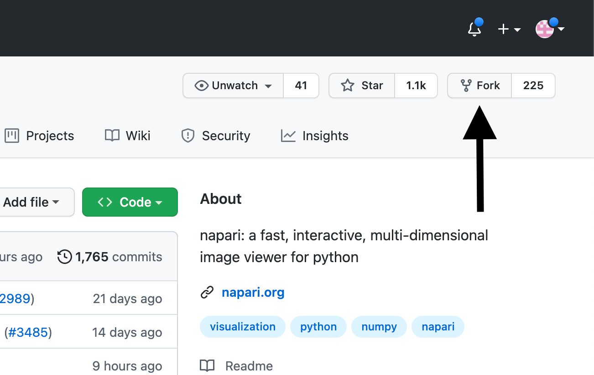
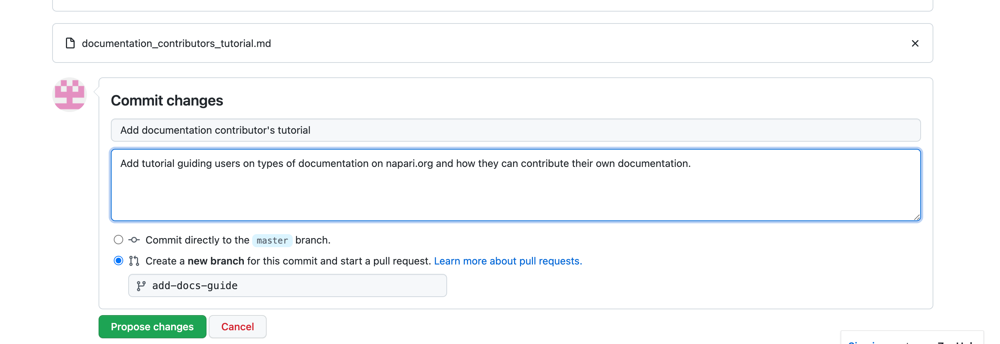
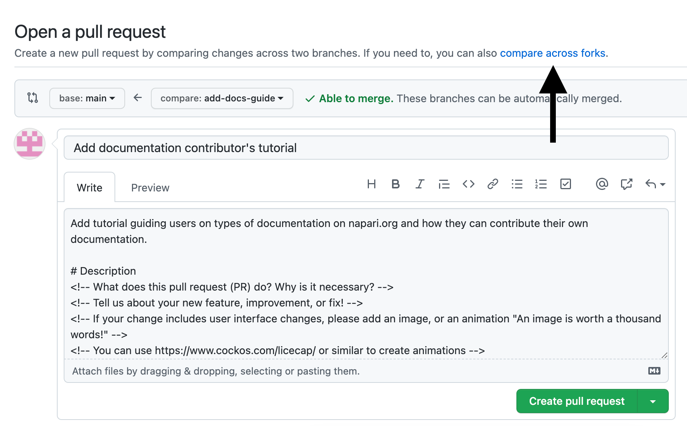
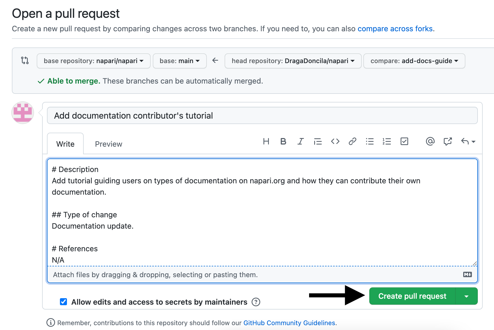
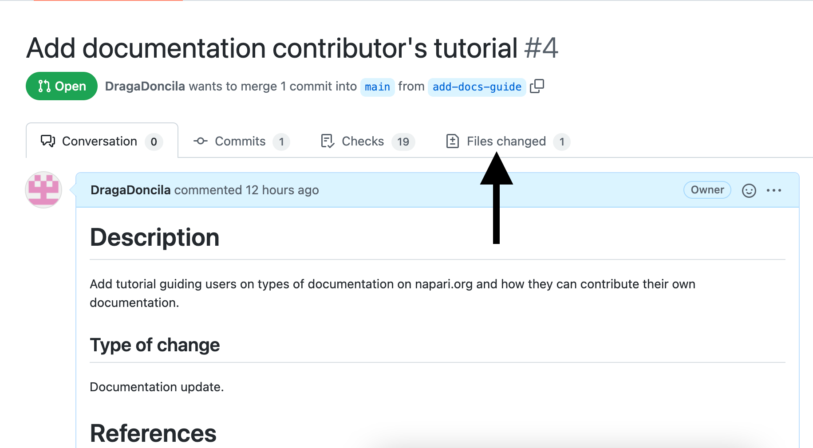

---
jupytext:
  formats: ipynb,md:myst
  text_representation:
    extension: .md
    format_name: myst
    format_version: 0.13
    jupytext_version: 1.10.3
kernelspec:
  display_name: Python 3 (ipykernel)
  language: python
  name: python3
---

# How to open a pull request on GitHub for new documentation

This how-to will guide you to open a pull request in GitHub to contribute your prepared document to napari.org. 

This guide is strictly designed for adding new documents - if you want to contribute code to napari check out [this guide instead](../contributing.md).

```{note}
Don't yet a have a document ready? Check out our [main guide](./index.md) to find templates and learn how to prepare your document!
```

## Prerequisites

- a new document for napari.org
    - Your document should already be prepared for submission. Check out [our contributor's guide](./index.md) to learn how to prepare your document
- a [GitHub account](https://github.com)

## 1. Fork the napari repository

Signed into your GitHub account, go to the [napari repository](https://github.com/napari/napari) and fork it to your own account by clicking the `Fork` button in the top right.



## 2. Navigate to the right folder

Click on folder names within the repository to navigate to the folder where your document needs to go.

- **Explanations** go in `napari/docs/guides/`
- **Tutorials** go in `napari/docs/tutorials/`
- **How-tos** go in `napari/docs/howtos`

Not sure where to place your document? Make a best guess and open the pull request - the napari team will
help you edit your document and find the right spot!
## 3. Upload your file

Once you're in the right folder, you can upload your MyST markdown file. 
Check out [this guide](./index.md#3-pair-your-notebook-with-myst-markdown) if you have a Jupyter notebook file you need to convert to MyST markdown.

To upload, click on `Add File -> Upload Files`, then drag your file into the box or click `choose your files` and navigate to the document on your computer.


## 4. Open the Pull Request

Once your file has finished uploading, scroll down and add a title and description for this change. Then, choose the `Create a new branch for this commit and start a pull request` option, optionally choose a descriptive name for your branch, and click `Propose changes`. This will open the PR creation page.



## 5. Choose `napari/napari` as destination

When you first see the Pull Request screen, it will be trying to pull from your branch e.g. `add-docs-guide` into *your forked repository's* `main` (or `master`) branch. We need to change this to point to the original napari repository. 

To do so, click on `compare across forks` in the subtitle of the page.



```{admonition} Don't see the "compare across forks" button?
:class: tip

[Follow this link](https://github.com/napari/napari/pulls) and click on "New pull request" in the top right.
You should then see the `compare across forks` button, and you'll be able to select the branch you just created
in your fork to merge into `napari/napari`.
```

Once you're comparing across forks, select `base repository: napari/napari` and `base: main` by clicking on the buttons and selecting from the dropdowns.


## 6. Open your pull request

You'll notice a lot of text in the Pull Request description box. This is our PR template - you can edit it as you like, and add any further detail you might want people to know about your document when reviewing it.

Once you're done editing, click the "Create pull request" button!



## 7. Making revisions

Now that you've created your pull request, someone from the napari team will review it and either approve it or ask for a few changes or revisions. If you need to make revisions, you can do so by editing the file directly on GitHub.

On your pull request, click on the `Files changed` tab.



Once you're there, click on the three dots in the top right of your file, and then select `Edit file`.


You can make the required changes to your file, and then scroll to the bottom of the page. Just like when you first opened your pull request, you should add a title and (optionally) a description for the set of changes you've just made. Then, keep the preselected `Commit directly to the *your-branch-name* branch` option, and click `Commit changes`.


This automatically updates your pull request with the latest changes to the file. If you're not sure how to update the file with the desired changes, don't hesitate to comment on your pull request and let the napari team know! We're more than happy to help you through the process, and we can also update your pull requests ourselves if you prefer.

Once your pull request is approved, a napari core developer will merge it, and your document will be visible on `napari.org`!

## Further Reading

- You can learn more about pull requests using the [GitHub docs](https://docs.github.com/en/pull-requests/collaborating-with-pull-requests/proposing-changes-to-your-work-with-pull-requests/about-pull-requests)
- You can read about our review and contribution process [here](../core_dev_guide.md)

