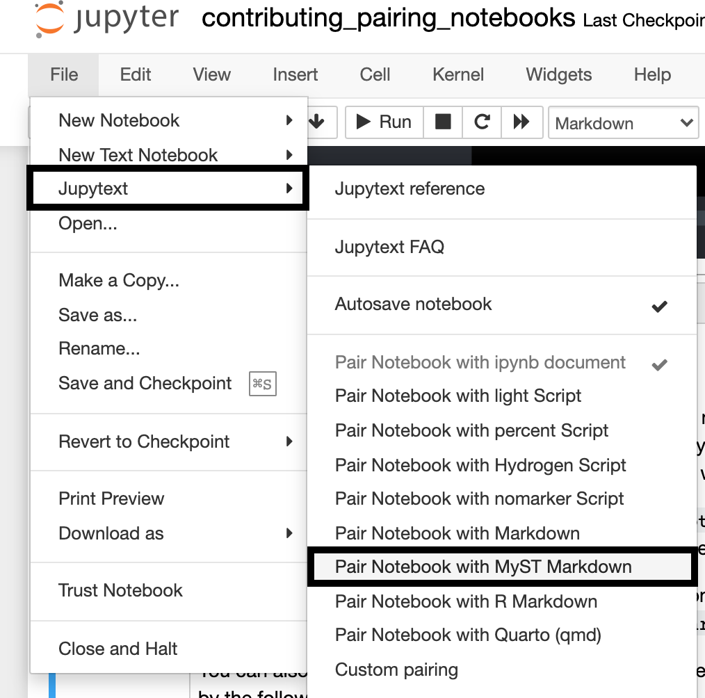

---
jupytext:
  formats: ipynb,md:myst
  text_representation:
    extension: .md
    format_name: myst
    format_version: 0.13
    jupytext_version: 1.10.3
kernelspec:
  display_name: Python 3 (ipykernel)
  language: python
  name: python3
---

# Learn to prepare Jupyter notebooks for contributing to napari documentation
Guided by this tutorial, you will prepare a Jupyter notebook for submission to napari's documentation.

```{note}
This tutorial assumes you have an existing notebook you're wanting to submit to napari.org. If you don't have one, you can download our [tutorial](./tutorial_template.md) or [how-to](./how_to_template.md) template first. If you want a broader overview of napari documentation and what you could submit, check out our [documentation contributor's overview](./index.md).
```

## You'll learn:
- How to use napari's `nbscreenshot` utility to produce screenshots of the napari Viewer
- How to use tags on Jupyter notebook cells to show/hide input
- How to use Jupytext to pair your notebook with a markdown file

## You'll need:
- [Jupyter notebook](https://jupyter.org/) installed
- Familiarity with Jupyter notebooks (code cells and markdown cells)
- Familiarity with using napari through a Jupyter notebook
- A Jupyter notebook you'd like to contribute as a how-to, tutorial or explanation to napari's documentation

## Using `nbscreenshot`
It's common for napari documentation to include code that has some effect in the napari Viewer e.g. adding layers,
changing layer properties or using a plugin. These changes in the Viewer should be shown to the user, and this can
be easily achieved in your notebook with napari's `nbscreenshot` utility.

This utility allows you to pass an active Viewer as a parameter and produces a screenshot of the Viewer at that 
point in time. This screenshot will be displayed to the user in the notebook.

```{code-cell} ipython3
import napari
from napari.utils import nbscreenshot

viewer = napari.Viewer()
# opens sample data and adds layer to the Viewer
viewer.open_sample('scikit-image', 'cells3d')

# takes a screenshot and produces it as output for this cell
nbscreenshot(viewer)
```

## Hiding input

As you can see, it's simple to produce screenshots of the napari Viewer in your notebooks. However, if you look through napari's
existing documentation, none of the code cells include calls to `nbscreenshot`, yet the screenshots are still produced. In fact,
it would be distracting if all the code cells included `nbscreenshot`, and might be frustrating for users who
want to execute these notebooks in their own workflows.

To avoid this frustration, we place calls to `nbscreenshot` in a hidden cell in your notebooks.
You can completely remove input (i.e. the code that's running) in a notebook cell by adding a `remove-input` tag to the cell metadata.

### Adding Tags
How you add cell tags depends on how you're editing your notebook. 

1. If you're working in Jupyter notebook,
you can open up the Tags toolbar for your cell using `View -> Cell Toolbar -> Tags`. You can then add any tags you want
(e.g. `remove-input`) by typing into the text entry box of the toolbar and clicking `Add Tag`. 
Here's what the Tags toolbar looks like, at the top right of this very cell.


2. If you're writing a MyST Markdown notebook, you can add tags directly to your code blocks e.g.

    ```{code-cell}
    :tags: [remove-input]

    print("Your code here")
    ```

### What to put in hidden cells

Alongside your call to `nbscreenshot`, you can also place other potentially distracting code in these tagged cells, 
such as resizing the Viewer window or opening a menu. In general, if you're running code the reader isn't meant to run,
this should be in a hidden cell.
The screenshot below is produced by the following code, which has been hidden from you using the `remove-input` tag.

```python
from napari.utils import nbscreenshot

viewer.window._qt_window.resize(750, 550)
nbscreenshot(viewer)
```

Note how we've included the `nbscreenshot` import in this hidden cell. Even though in the
example above we imported `nbscreenshot` to show its functionality, you should place the
import in a hidden cell when you write your documentation.

```{code-cell} ipython3
:tags: [remove-input]

from napari.utils import nbscreenshot

viewer.window._qt_window.resize(750, 550)
nbscreenshot(viewer)
```

## Converting your notebook

While Jupyter notebooks are a great format for sharing code workflows alongside their explanations, their raw JSON representation is not great
for versioning. [Jupytext](https://jupytext.readthedocs.io/en/latest/index.html) is a Jupyter plugin that allows you to convert your notebooks
to markdown files or scripts. 

In napari's documentation we use MyST Markdown files for tutorials, how-tos or explanations that contain a lot of code. The Jupytext plugin
allows you to pair your notebook with a MyST Markdown file in Jupyter Notebook, or convert your notebook to a markdown file in the command line.

### Installing Jupytext
You can install `jupytext` from the command line:

```
pip install jupytext
```

or

```
conda install jupytext -c conda-forge
```

### Pairing your notebook
Once installed, you can start Jupyter notebook as you usually would. Pairing your notebook with MyST Markdown
 will now be an option in the notebook's `File -> Jupytext` menu, as in the screenshot below. Selecting this option will generate a new markdown file
 for you in the same working directory as your notebook.



You can pair your notebook from the command line as well using the following command:

```
jupytext --set-formats ipynb,myst your_notebook.ipynb
```

Then, after making any changes to your notebook, run:

```
jupytext --sync your_notebook.ipynb
```

You can also just convert a notebook from the command line, though this will not *sync* your notebook with your markdown document - any changes to the notebook would require another conversion. To convert your notebook from the command line run:

```
jupytext your_notebook.ipynb --to myst
```

That's it! `your_notebook.md` is now ready to contribute to napari!

+++

## Next steps
- Not sure what type of contribution to make? Check out our guide for different types of documentation (coming soon...)!
- 

## Further reading

- If you want more information on adding tags as cell metadata, check out [this Jupyter Book guide](https://jupyterbook.org/content/metadata.html#jupyter-cell-tags)
- You can hide cells in a number of different ways besides `remove-input` which we've shown here. [This guide](https://jupyterbook.org/interactive/hiding.html#hide-code-cell-content) 
walks through the different options.
