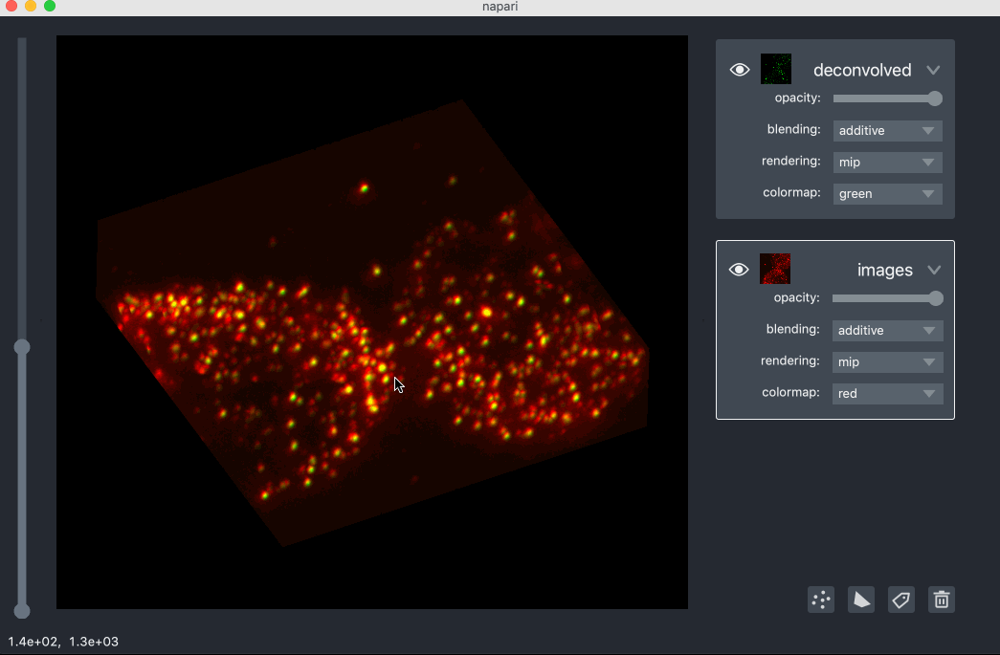

# napari gallery

Welcome to the **napari** gallery!

This gallery contains examples showing real scientific data visualized and annotated with **napari**.

### pathology data

This example shows an ~100k x 200k pixel pathology slide from the [camelyon 16 challenge](https://camelyon17.grand-challenge.org/Data/) for cancer detection in pathology images. We converted the multiresolution image pyramid data into a [zarr](https://zarr.readthedocs.io) file, which we could lazily read using [dask](https://dask.readthedocs.io/en/latest/), a python library for flexible parallel computation.

We visualized the slide using a `Pyramid` layer. This layer allows us to dynamically swap in different resolution levels and image tiles depending on the zoom level so we can easily browse this large dataset without having to load it all into memory.

We also extracted the coordinates of two tumors on this slide and visualized them us a `Shapes` layer. During the gif you can see us add a new `Shapes` layer and start drawing shapes over both whole areas of tissue and individual cells.

### lattice light-sheet data

This example browses over 100GB of [lattice lightsheet](https://science.sciencemag.org/content/360/6386/eaaq1392) data, representing a volumetric timeseries. Using the sliders we can move through both the `z` dimension and the `time` dimension. The data is stored on disk as a [zarr](https://zarr.readthedocs.io) file, which are lazily reading using [dask](https://dask.readthedocs.io/en/latest/).

### mesoscope neural activity

This example shows neural activity recorded with the [2-photon random access mesoscope](https://elifesciences.org/articles/14472). The bottom `Image` layer contains the underlying timeseries of neural activity. The subsequent `Image` layers contain processed maps, such as the mean, local correlation or colored correlations with other timeseries data.

### calcium imaging of neurons

This example shows calcium imaging of neurons to record neural activity, and is one of the example datasets in the [neurofinder](http://neurofinder.codeneuro.org/) image segmentation challenge. The bottom `Image` layer contains timeseries of the neural activity. The top `Labels` layer contains the segmented neuron regions. The middle two `Image` layers contain helpful processed maps, the mean and the local correlation of the timeseries.

In this example we use the paintbrush and fill bucket tools in the `Labels` to separate two regions that were incorrectly merged and two add two regions that were missed.

## electron microscopy volume

This example shows 3D electron microscopy data from the [CREMI](https://cremi.org/) circuit reconstruction challenge. The bottom `Image` layer contains the underlying electron microscopy image. The `Labels` layer immediately above it contains the segmentation mask, where each colored region corresponds to one neuron. Pre- and post-synaptic sites are marked with `Points` layers.

### allen brain reference atlas

This example shows the [allen brain reference atlas](https://mouse.brain-map.org/static/atlas), a 3D map of the mouse brain, including its division into different brain areas. The bottom `Image` layer contains the underlying grayscale representation of the reference brain, and the top `Labels` layer contains the divisions into different brain regions, where each colored region corresponds to a different part of the brain.

### image-based transcriptomics

This examples shows some image-based transcriptomics data analyzed with the [starfish tool](https://spacetx-starfish.readthedocs.io/en/latest/). Each spot in the image corresponds to an mRNA molecule. The bottom `Image` layer is the raw image data. The middle `Image` layer is the raw data after a learnt deconvolution, and the top `Points` layer corresponds to the detected mRNA spots.

We can also visualize the raw and deconvolved layers as 3D volumes using the `Volume` layer.

Here the raw volume is shown in a `red` colormap, and the deconvolved volume is shown in a `green` colormap.

Data courtesy of Tim Wang, Svoboda Lab.

### cell biology

This examples shows images of cells under brightfield and fluorescent imaging. There are four color channels of flourescently label data all blended together, showing the cell nuclei and the distribution of targets of interest. The top `Labels` layer shows some hand drawn regions around the nuclei, which can been seen in blue.

We can also visualize the flourescent data as `Volume` layers too.

Data from Allen Cell.

### cells

This example shows 3 color channels of data of cell nuclei, membranes, and cytoplasm represented using three different `Image` layers with different colormaps, blended together. The top `Points` layer contains markers over the centers of the cell nuclei. The second from the top `Shapes` layer, contains polygon representations of the boundaries of the cells. Data from ImageJ examples.

During the example we edit the position of some of the points, and shapes, including deleting existing ones and adding new ones.

### volumetric rendering

This example shows 3D rendering of a stent, and includes the changing of colormaps and color limits. Data from vispy examples.

### geospatial

This example shows data from the [landsat-8](https://landsat.gsfc.nasa.gov/landsat-8/mission-details/) survey.

### kaggle nuclei segmentation

This example browses data from the [2018 kaggle data science bowl](https://www.kaggle.com/c/data-science-bowl-2018) on nuclei segmentation. The raw images are visualized using an `Image` layer and the segmentations are visualized using a `Labels` layer.

We are using [dask-image](https://dask-image.readthedocs.io) to look at directories of the images and labels and lazily them when requested by the slider. This method can support easy browsing of training datasets with many many examples as we never need to load all the images into memory. Note that not all images need to be the same size either.

We can also edit or create our own segmentations using the paintbrush and fill bucket tool in the `Labels` layer.

## machine learning

This example shows data from a [hymenoptera classification task](https://pytorch.org/tutorials/beginner/transfer_learning_tutorial.html) where the goal is to separate the images of the ants and bees. Here we are using [dask-image](https://dask-image.readthedocs.io) to look at two directories of images and lazily load each image when requested by the slider. This method can support easy browsing of training datasets with many many images as we never need to load all the images into memory. Note that not all images need to be the same size either.
