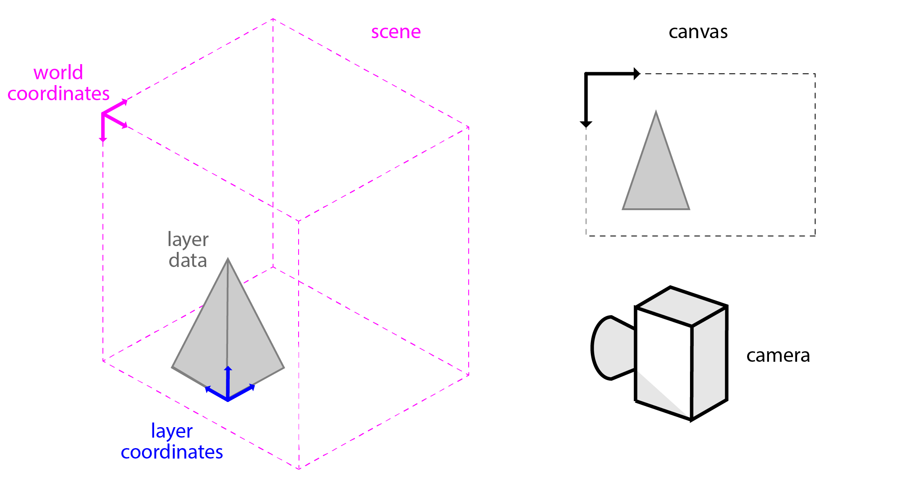
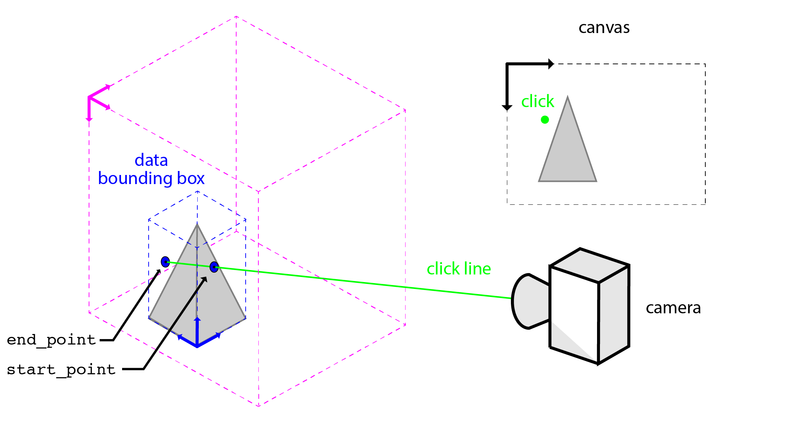

# 3D interactivity

## Coordinate systems in napari
In napari, there are three main coordinate systems: (1) canvas, (2) world, and (3) layer. The canvas coordinates system is the 2D coordinate system of the canvas on which the scene is rendered. World coordinates are the nD coordinates of the entire scene. As the name suggests, the layer coordinates is the nD coordinate system of the data in a given layer. Layer coordinates are specific the each layer's data and are related to the world coordinate system via the layer transforms.



## In 3D mode, clicks are lines
Since the 3D scene is rendered on a 2D surface (your screen), your mouse click does not map to a specific point in space. Thus, when rendering a scene in 3D, napari interprets your click as a line in the direction of the camera view that goes through the point that view ray intersects the camera plane.


When a user clicks or moves the mouse in the canvas, napari emits a mouse event with the following properties:


- pos: the position of the click in canvas coordinates.
- position: the position of the click in world coordinates.
- view_direction: a unit vector giving the direction of the camera in
    world coordinates.
- dims_displayed: a list of the dimensions currently being displayed
    in the viewer. This comes from viewer.dims.displayed.
- dims_point: the indices for the data in view in world coordinates.


## Determining where the click intersects the data
Each napari layer has a method called `get_ray_intersections()` that will return the points on the data bounding box that a given line will intersect (`start_point ` and `end_point `). `start_point` and `end_point` are  the end points of line segment that intersects the layer's axis-alinged data bounding box. `near_point` is the end point that is closest to the camera (i.e, the "first" intersection") and `far_point` is the end point that is farthest from the camera (i.e., the "last" intersection).



See the `get_ray_intersection()` docstrings below for details. Note that if the line does not intersect the data bounding box (i.e., the click was outside of the data), `start_point` and `end_point` are `None`. The `position` and `view_direction` should be provided as world coordinates if `world` is set to True and in layer coordinates if `world` is set to `False`.

```
def get_ray_intersections(
    self,
    position: List[float],
    view_direction: np.ndarray,
    dims_displayed: List[int],
    world: bool = True,
) -> Union[Tuple[np.ndarray, np.ndarray], Tuple[None, None]]:
    """Get the start and end point for the ray extending
    from a point through the data bounding box.

    Parameters
    ----------
    position :
        the position of the point in nD coordinates. World vs. data
        is set by the world keyword argument.
    view_direction : np.ndarray
        a unit vector giving the direction of the ray in nD coordinates.
        World vs. data is set by the world keyword argument.
    dims_displayed :
        a list of the dimensions currently being displayed in the viewer.
    world : bool
        True if the provided coordinates are in world coordinates.
        Default value is True.

    Returns
    -------
    start_point : Optional[np.ndarray]
        The point on the axis-aligned data bounding box that the cursor click
        intersects with. This is the point closest to the camera.
        The point is the full nD coordinates of the layer data.
        If the click does not intersect the axis-aligned data bounding box,
        None is returned.
    end_point : Optional[np.ndarray]
        The point on the axis-aligned data bounding box that the cursor click
        intersects with. This is the point farthest from the camera.
        The point is the full nD coordinates of the layer data.
        If the click does not intersect the axis-aligned data bounding box,
        None is returned.
	"""
```

## Custom 3D interactivity
Custom 3D interactivity can be added via mouse callbacks. The `layer.get_ray_intersections()` function has been designed to work seamlessly with the napari mouse callback event.

```
@layer.mouse_drag_callbacks.append
def on_click(layer, event):
	# get the points where the click intersects the 
    start_point, end_point = layer.get_ray_intersections(
        position=event.position,
        view_direction=event.view_direction,
        dims_displayed=event.dims_displayed,
        world=True
    )
    if (start_point is not None) and (end_point is not None):
    	# use start_point and end_point to interrogate layer data
```

For an example implementation, see the [`cursor_ray.py`](https://github.com/napari/napari/blob/master/examples/cursor_ray.py) example.

# Resources
PRs in which the 3D interactivity was added:
