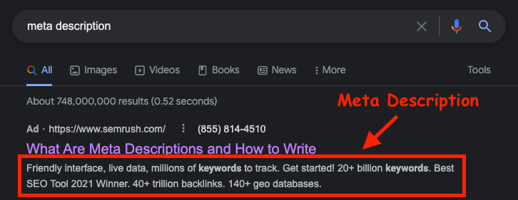
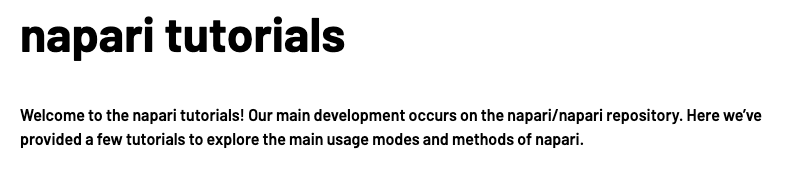
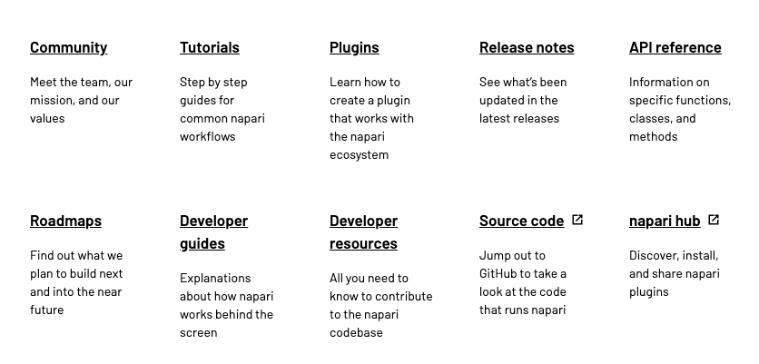
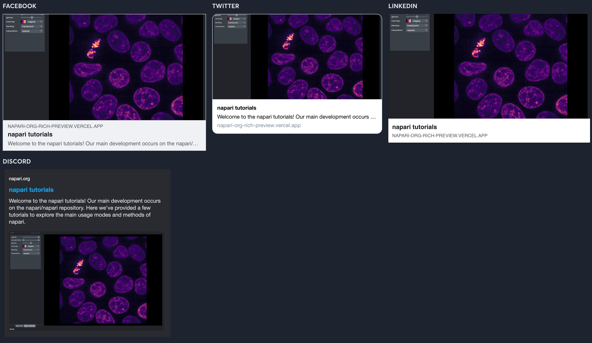
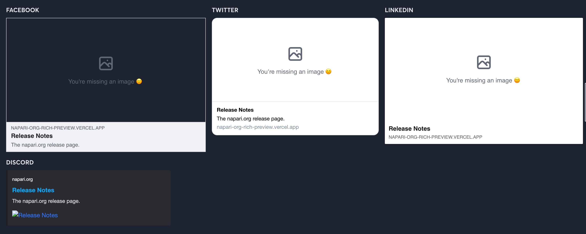

# napari theme

Source for napari's custom theme. The theme is implemented using React and built
using Next.js.

## Page Customization

Markdown files can include front-matter data to customize the rendering of a page.

### `metaDescription`

**Type**: `string`

Text for populating the `<meta description="name">` tag, which is the text used
in Google search results. You should at least try to include one for every page
if possible.

You can also use `intro` if you want to use the same string for the intro and
meta tag. However, if you use both the `intro` and `metaDescription` variables,
then the `metaDescription` will override the `intro` for the meta description
tag.

#### Example

```md
---
theme:
  metaDescription: This page has release notes for napari viewer.
---

# Release Notes

Release notes for napari versions.
```

#### Output



### `intro`

**Type**: `string`

Text to render at the top of the page above the content. This value is used for
the `<meta description="name">` tag if `metaDescription` is not defined.

#### Example

```md
---
theme:
  intro: This page has tutorials for napari.
---

# napari tutorials

Welcome to the napari tutorials!
```

#### Output



### `quickLinks`

**Type**:

```ts
export interface QuickLinkItem {
  title: string;
  content: string;
  url: string;
}
```

Links to render at the bottom of the page. Mostly used for the home page, but it
can be used from any page.

#### Example

```md
---
theme:
  quickLinks:
    - title: Community
      content: Meet the team, our mission, and our values
      url: /community/index.html

    - title: Tutorials
      content: Step by step guides for common napari workflows
      url: /tutorials/index.html

    ...
---

# napari

## multi-dimensional image viewer for python

...
```

#### Output



### `previewImage`

**Type**: `string`

Image to use when rendering social previews. If this value is not defined, then
the theme will use the first image on the page. See [Social
Previews](#social-previews) for more details.

#### Example

```md
---
theme:
  intro: The napari.org guides page.
  previewImage: /napari.jpg
---

# Release Notes

Release notes for napari versions.
```

#### Output



### Social Previews

The napari theme includes meta tags for rendering rich previews on OpenGraph
websites and Twitter. This allows us to display a unique title, description, and
image for each link:


To enable rich previews for a page, you'll need to have:

1. An H1 tag on the page.
1. Use [`intro`](#intro) or [`metaDescription`](#metaDescription) in the frontmatter.

To include an image in the preview, you can either:

1. Add an image to the page, and the theme will use whatever is first.
1. Use the [`previewImage`](#previewimage) variable.

If you don't do one of the above, then the preview will show a `missing image` icon instead.



## How does it work?

We use a combination of Node and Python tooling to build the napari.org. We use
Jupyter Book to build the documentation's HTML, and then Next.js to build the
theme.

This works by running `jupyter book build .` to build the HTML. This produces
HTML that is specifically [templated](./napari/page.html) a certain way for
easier web scraping.

We then use a [catch-all page](./src/pages/%5B%5B...parts%5D%5D.tsx) to render
every page generated by the documentation. This page then uses the
[getStaticProps()](https://nextjs.org/docs/basic-features/data-fetching#getstaticprops-static-generation)
function to scrape the HTML created by `jupyter-book build`.

To build the page for production, we then run `next build` to build the source
code and then `next export` to export the application as HTML. This is known as
[pre-rendering](https://jamstack.org/glossary/pre-render/), and it works by
having the Next.js server render every page once to an HTML file. This then
allows us to distribute the docs + theme as HTML so we can upload it to GitHub
pages.

```

```

```

```
