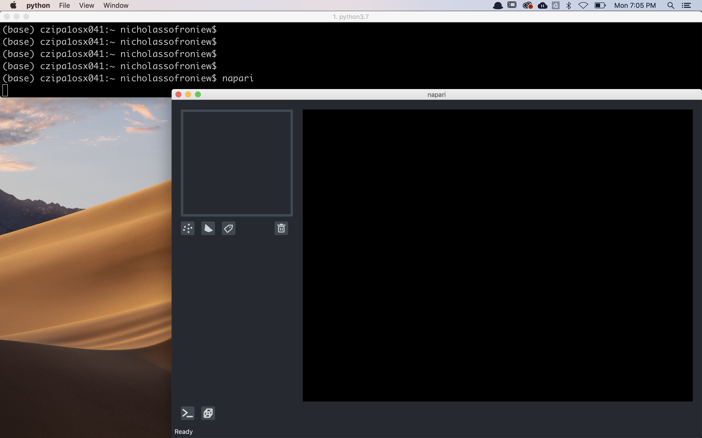

# napari installation tutorial

Welcome to the **napari** installation tutorial!

This tutorial will teach you how to do a clean install of **napari**. It is
aimed at people that just want to use napari. For people also interested in
contributing to napari please check our [contributing
guidelines](https://github.com/napari/napari/blob/master/docs/developers/CONTRIBUTING.md)
for more advanced installation procedures. At the end of the tutorial you should
have napari successfully installed on your computer and be able to make the
napari viewer appear.

## installation

### which distribution to install

If you want to contribute back to the napari codebase, you should install from
source code: see the [from source](#clone-the-repository-locally-and-install-in-editable-mode) section.

If you only wish to use napari as GUI app (and not from python code), the
[bundled app](#installing-as-a-bundled-app)
is the easiest way to install, it does not require having python pre-installed.

If you are using napari from Python to programmatically interact with the app,
you can install via pip, conda-forge, or from source.

### from pip, with "batteries included"

napari can be installed on most macOS, Linux, and Windows systems with Python
3.7, 3.8, and 3.9 using pip:

```sh
pip install 'napari[all]'
```

*(See `Specifying a GUI Backend` below for an explanation of the `[all]`
notation.)*

````{important}
While not strictly required, it is *highly* recommended to install
napari into a clean virtual environment using an environment manager like
[conda](https://docs.conda.io/en/latest/miniconda.html) or
[venv](https://docs.python.org/3/library/venv.html).  For example, with `conda`:

```sh
conda create -y -n napari-env python=3.8
conda activate napari-env
pip install 'napari[all]'
```
````

### from conda-forge

If you prefer to manage packages with conda, napari is available on the
conda-forge channel. You can install it with:

```sh
conda install -c conda-forge napari
```

### install from the master branch on Github

To install the "next-release" version from github via pip, call

```sh
pip install git+https://github.com/napari/napari.git#egg=napari[all]
```

### clone the repository locally and install in editable mode

To clone the github repository for local install

```sh
git clone https://github.com/napari/napari.git
cd napari
pip install -e .[all]
```

## checking it worked

After installation you should be able to launch napari from the command line by
simply running

```sh
napari
```

An empty napari viewer should appear as follows



## upgrading

If you installed napari with `pip` you can upgrade by calling

```sh
pip install napari[all] --upgrade
```

## choosing a different Qt backend

````{admonition} Specifying a GUI Backend
:class: tip

napari needs a library called [Qt](https://www.qt.io/) to run its user interface
(UI). In Python, there are two alternative libraries to run this, called
[PyQt5](https://www.riverbankcomputing.com/software/pyqt/download5) and
[PySide2](https://doc.qt.io/qtforpython/). By default, we don't choose for you,
and simply running `pip install napari` will not install either. You *might*
already have one of them installed in your environment, thanks to other
scientific packages such as Spyder or matplotlib. If neither is available,
running napari will result in an error message asking you to install one of
them.

Running `pip install 'napari[all]'` will install the default framework – currently
PyQt5, but this could change in the future.

To install napari with a specific framework, you can use:

```sh
pip install 'napari[pyqt5]'    # for PyQt5

# OR
pip install 'napari[pyside2]'  # for PySide2
```
````

*Note: if you switch backends, it's a good idea to `pip uninstall` the one
you're not using.*

## installing as a bundled app

napari can also be installed as a bundled app on each of the major platforms,
MacOS, Windows, and Linux with a simple one click download and installation
process. You might want to install napari as a bundled app if you are unfamiliar
with installing Python packages or if you were unable to get the installation
process described above working. The bundled app version of napari is the same
version that you can get through the above described processes, and can still be
extended with napari plugins installed directly via the app.

To access the cross platform bundles you can visit our [release
page](https://github.com/napari/napari/releases) and scroll to the release you
are interested in and expand the `assets` tab to get a view that looks like
this:


You can then download the appropriate zip file for your platform.

### installing the MacOS bundle

Once you have downloaded the MacOS bundle zip you will have a zip file with a
name like `napari-0.3.7-macOS.zip`. After unzipping you will have a file with a
name like `napari-0.3.7.dmg`. Double clicking the `dmg` will open a new finder
window giving you the option to install napari into your `Applications` folder
by dragging the `napari` icon onto the `Applications` icon.


After you drag the `napari` icon onto the `Applications` icon napari will be
installed in your Applications folder and available for opening by double
clicking on it.


The first time you try and open napari you will get the "unverified developer
warning" that appears bellow:


Don't be alarmed, this is because the napari team has not yet obtained a
developer certificate from Apple, but we will be doing this promptly. It is safe
to click "Cancel". To get napari to open you must enter "Systems Preferences"
and click the "Security & Privacy" icon, circled in red below:


Once inside the "Security & Privacy" tab, you should see a message about napari
being blocked and an "Open Anyway" button, circled in red below:


After clicking this button you'll get one final warning about napari not being
verified, but now you'll have an "Open" button, as seen below:


After clicking "Open", the viewer should appear. Don't worry, you only have to
go through this process once when you install a new bundle.

### installing the Windows bundle

Once you have downloaded the Windows bundle zip you will have a zip file with a
name like `napari-0.3.7-Windows.zip`. Unzip the bundle (you may like to use a
tool like [7-zip](https://www.7-zip.org/) for this) and double click on msi
file, eg: `napari-0.3.7.msi`

The napari setup wizard will then open. Click "Next" to begin the installation.


After the setup wizard has installed napari, click "Finish" to exit.


When you launch the bundled napari app on Windows, first you'll see an empty
command terminal appear (do not close this window - you can ignore it). The
command terminal will be followed by a napari splash screen, and then the main
napari user interface window will appear a few seconds later. Note that errors
which might occur during your napari session will appear on the command terminal
- so if something is not working, it might pay to take a look at the terminal!


You can launch napari from the Windows start menu.


The very first time you launch napari the startup time will be fairly slow, but
after that you will find that napari launches more quickly.


### installing the Linux bundle

(Guide coming soon... In the meantime, if you try it and encounter issues, see
below for how to contact us.)

## bug reports

If you are running into issues, please open a new issue on our [issue
tracker](https://github.com/napari/napari/issues) and include the output of the
following command

```sh
napari --info
```

## help

We're a community partner on the [imagesc
forum](https://forum.image.sc/tags/napari) and all usage support requests should
be posted on the forum with the tag `napari`. We look forward to interacting
with you there.

## next steps

Now that you've got napari installed, checkout our [getting
started](./getting_started) tutorial to start learning how to use it!
